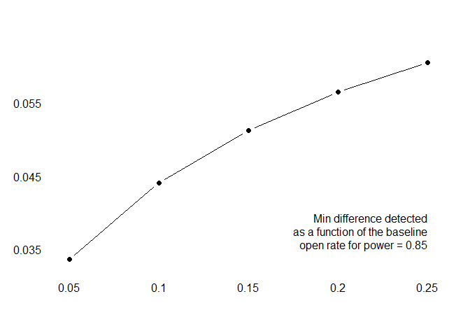

Examining the Effects of
================
Taeil Goh, Greg Tozzi & Max Ziff
December 06, 2020

## Executive Summary and Recommendations

Thank you for the opportunity to work with the Children’s Science
Center. Below you will find a summary of our finding and
recommendations. Details of our analysis are included in the technical
report that this summary.

### Research Questions

We sought to answer two questions posed by the Center. Both questions
were related to emails sent by the Center soliciting donations.

1.  Is there a difference in email opening or click-through caused by
    the choice of using the Executive Director’s name and title in the
    from line versus using the Board Chair’s name and title? *While we
    did observe a difference in opening rates favoring emails from Jill
    McNabb, the difference was not significant.*
2.  Is there a difference in email opening or click-through behavior
    caused by the choice of using one of two potential subject lines?
    *The subject line, “You can be a Catalyst for STEM Learning 💡,”
    caused significantly higher opening rates.* We did not observe
    enough clicks to draw conclusions about the effect of the subject
    and from line choices on click-through rate.

### Review of the Methodology

The Center provided our team with a list of approximately 12,000
potential subjects for this study. This list was compiled from the
Center’s Altru database but specifically excluded individuals who were
previously selected by the Center to receive a solicitation by
traditional mail. We randomly selected 1,980 subjects to receive an
email soliciting a donation. These individuals were evenly split into
four groups of 495 with each group being assigned a unique combination
of from and subject lines. The 68% of the population that had mailing
addresses on file with the Center also had metadata provided by
Boodle.ai related to their predicted affinity for various causes. We
used this metadata to check the balance of our random assignment

The Center provided a final quality assurance check of the individuals
we assigned to the study and removed 23 records. The Center sent emails
to the remaining individuals using Mailchimp on October 20, 2020. We
extracted the results from Mailchimp on October 28, 2020.

### Results

Results for open rates are summarized below.

| Open Rates (24% avg)                   | You can be a Catalyst for STEM Learning 💡 (26.4%) | Invest in the Power of STEM Learning 💡 (21.6%) |
| -------------------------------------- | ------------------------------------------------- | ---------------------------------------------- |
| Nene Spivy, Executive Director (22.8%) | 24.4%                                             | 21.2%                                          |
| Jill McNabb, Board Chair (25.2%)       | 28.2%                                             | 22.0%                                          |

### Recommendations

Notes on Applying the Results We are confident that the method we
employed in this case produced evidence that the difference in opening
rates was caused by the difference in subject lines. You can reasonably
expect that this result would generalize to the remainder of the
candidate email recipients during the current year-end fund drive. We
suggest caution when drawing broader conclusions, however for the
following reasons:

1.  Responsiveness to the two subject lines may have been affected by
    factors that we could not control for, including the current public
    health and political situations.
2.  We drew our subjects from a filtered list of potential recipients.
    Adding individuals to the population of recipients may invalidate
    the study’s results.

`place holder`

## Introduction and Context

#### The Children’s Science Center

The Children’s Science Center (“the Center”) is a non-profit
organization headquartered in Fairfax, Virginia. Founded in TODO, the
Center’s principal objective is to build the Northern Virginia region’s
first interactive science center at a greenfield location on donated
land in Reston, Virginia. The capital campaign to raise fund to build
this facility is the Center’s primary line of effort. A recent
partnership with the Commonwealth of Virginia’s

Recognizing the long-term nature of the capital campaign and the need to
build interest and advocacy, the Center launched a series of
intermediate efforts beginning in `TODO.` The Center’s first outreach
effort was the Museum without Walls, a program that delivered
science-based programs to schools around the region. In `TODO`, the
Center launched the Lab, a test facility located in a shopping mall
sited 12 miles outside of the Washington, DC Beltway. The Lab hosted
approximately `TODO` guests per year until it was temporarily shut down
in response to the COVID-19 pandemic.

The Center funds operating expenses with Lab admissions, grants, and
philanthropic giving. The Center’s Development Department is responsible
for developing and managing the latter two revenue streams.

##### The Fundraising Surge

The Center conducts a fundraising surge toward the end of the calendar
year, consistent with the charitable giving cycle in the United States
\[`TODO`: add reference\].

The Center expected to engage the majority of its stakeholders by email.
The Center viewed email marketing as repeated iterations of a three step
process. The Development Director expected that several rounds of
engagement would be necessary to achieve a conversion in the form of a
charitable gift. Within each individual round, the path to conversion
proceeded from receipt to opening to click-through using an embedded
link or button.

The Center introduced two major changes to its process ahead of the 2020
fundraising surge. In previous year-end campaigns, the Center had used
Constant Contact to send branded emails to stakeholders. In the 2020
campaign, the Center chose to switch to Mail Chimp’s free tier. The
Center also engaged a consulting firm that applies machine learning to
the nonprofit space to predict top prospects from among the Center’s
contact list and to predict affinities to aspects of the Center’s
mission. The consulting firm’s model requires a physical address as an
entering argument, and it was, therefore, only applied to that subset of
the Center’s contact list for which physical addresses were entered.
Based on the consulting firm’s output, the Center chose to engage a
subset of their stakeholder list with physical mail and to wall this
cohort off from subsequent email engagement.

#### Research Questions

The Center’s development staff was most strongly interested in
conducting experiments to maximize the opening rates of the Center’s
fundraising emails. The Development Director and her staff were keenly
aware that email opening was the critical first step in achieving
conversion. The follow-on actions—click though and conversion—were areas
of secondary interest for this study. With this in mind, we sought to
answer two specific questions posed by the Center.

1.  Is there a difference in email opening or click-through caused by
    using the Executive Director’s name and title in the from line of
    the solicitation email versus using the Board Chair’s name and
    title?

2.  Is there a difference in email opening or click-through behavior
    caused by the choice of using one of two potential subject lines?
    The two subject lines considered were, “You can be a Catalyst for
    STEM Learning 💡,” and , “Invest in the Power of STEM Learning 💡.”

## Research Proposal

#### Research Hypotheses

We claim expertise neither in non-profit email fundraising nor in the
preferences of the Center’s stakeholders. The Center’s development team
believed that there would be a significant difference in the opening
rates associated with the two email from lines considered, though the
staff did not have a sense of which would result in significantly higher
opening rates. Underpinning the staff’s expectation that we would find a
significant difference was their belief that the Center’s stakeholders
had a meaningful sense of the Center’s leadership and governance
structure and would react differently when presented with emails from
either the Executive Director or the Board Chair.

Both of the subject lines considered were written by the Center’s
development staff. The staff believed that subject lines could result in
significantly different opening rates but did not have a going-in belief
of which subject line would cause a stronger response.

#### Treatment in Details

`see page 428`

We constructed a factorial experiment to enable consideration of the
conditional average treatment effects (CATEs) across the four possible
assignments. With the cohort randomly assigned to four groups, and with
the from and subject lines denoted \(F_a\), \(F_b\), \(S_a\), and
\(S_b\), we assigned treatment combinations across balanced groups:

  - Group 1 - \(F_a\) and \(S_a\)
  - Group 2 - \(F_a\) and \(S_b\)
  - Group 3 - \(F_b\) and \(S_a\)
  - Group 4 - \(F_b\) and \(S_b\)

This design allows us to explore heterogeneous treatment effects.

Each group would received a tailored email containing its assigned
treatments sent through Mail Chimp. We intended to track opening and
click through using Mail Chimp’s out-of-the-box analytics.

#### Power calculation

The Center’s experience across all of its email-delivered messaging
suggested that we should expect opening rates on the order of 10%. To
understand what deviations from this expectation would yield, we
considered low, medium, and high baseline opening rates between 5% and
25% in our power calculations.

Powers between 0.8 and 0.9 are standard in clinical trials. We chose
0.85 as a target power and computed minimum detected differences for our
range of baseline rates. Entering into the experiment, we believed that
it would be unlikely that either treatment would produce differences in
means as large as those that the power calculations suggested that we
would need to report a significant finding.

<!-- -->

#### Enrollment Process & Criteria for Subjects

  - The criteria by which subjects were included
  - explain how subjects were randomly assigned to experimental groups
  - TG: need explanation of 2000 selection was randomized and no
    selection bias

The Center’s donor managment database contains over 41,000 individual
entries, roughly half which include physical addresses. Entries that
include a phyical address have metadata generated by a third party that
predict affinities for causes central to the Center’s mission. The
Center provided us a file listing 12,004 individuals that Center
intended to target by email during its Fall 2020 fundraising surge.
These individuals represent all of the database entries that include
email addresses less specifically excluded individuals (board members,
minor children, etc.) and less a special cohort that the Center intended
to target through a physical mail campaign based on the third party’s
predicted capacity and willingness to donate.

The Center provided three data files that we used to develop our
randomization. These files are located in the `data` directory in the
project repostiory.

1.  `anonymized_altru.csv` contains donor data for the Center’s entire
    database of over 41,000 individuals. Entries are keyed to a unique
    donor idnetificaiton number.
2.  `anonymized_mail.csv` contains entries for a subset of the complete
    database for which the Center has physical addresses on file. This
    file includes third-party generated predictions of affinities for
    germane causes. Entries are also keyed to a unique donor
    idnetificaiton number.
3.  `anonymized_index.csv` contains the unique donor identification
    numbers for the approximately 12,004 individuals that the Center
    intended to target by email during the Fall 2020 fundraising surge.

We agreed to target a random sample of 1,980 individuals for this
experiment. The intent was to remain within the bounds of the Mail Chimp
free tier while leaving a small margin for the Center’s staff to send
test emails to individuals outside of the experiment including to key
members of the Center’s staff and our group. The Center delivered one of
four solicitation emails via Mail Chimp’s web interface.

To select subjects, we first filtered the extract of the Center’s
compelte donor database on the list of individuals the Centered intended
to target by email. In the process, we removed three duplicated entries.

We had hoped to incorporate donor history into our randomization scheme
and balance checks, but the data provided by the Center was extremely
sparse and contained obvious errors. For every entry in the total gift
amount column was either zero or `NA` and 21 entries in the first gift
amount column were nonzero. The Center’s staff was well aware of the
data quality issues in their donor database. With zero covariates in the
provided data, we turned to the output of the third party study
contained in `anonymized_mail.csv`. We joined the data in that set to
our existing table.

``` r
subject_boodle <- read_subjects_mail('../randomization/anonymized_mail.csv')
subject_boodle <- subject_boodle[lookup_id %in% index_ids$`LOOKUP ID`]
merged_dt      <- merge(subject_data, subject_boodle, all = TRUE)

# De-duplicate (again)
duplicates_merged <- merged_dt[ , .(which(.N > 1)), keyby = lookup_id]$lookup_id
duplicate_index_merged <- which(merged_dt$lookup_id %in% duplicates_merged)
merged_index <- setdiff(1:nrow(merged_dt), duplicate_index_merged[c(1, 3)])
merged_dt <- merged_dt[merged_index , ]
```

As explained above, outputs of the third party study only existed for
individuals with mailing addresses on file. Only 8266 of the 12004
individuals in the population had data from the third party study as a
result. We discuss the implications to covariate balance checks in a
following section.

We conducted our randomization in two steps. First, we identified 1,980
individuals who would receive an email. Then, we randomly divided those
individuals into four treatment groups of 495 individuals each.

    ##    lookup_id treatment
    ## 1:      1000         2
    ## 2:      1001         1
    ## 3:      1010         1
    ## 4:      1012         2
    ## 5:      1016         4
    ## 6:      1026         2

#### Summary of Experimental Design

#### Validation of Randomization Procedure

  - check the soundness of the randomization procedure
  - covariate balance (see chapter 4)

#### Outcome Measures

  - Open and click-through rates.
  - mail chimp

Implementing the experiment involved finding the proper balance between
MailChimp’s technical capabilities, the Center’s expertise and
availability, and the need to respect the privacy of the individuals on
the Center’s mailing lists. Because the Center was new to MailChimp, it
was important to keep the implementation simple and inexpensive. This
ruled out the use of MailChimp’s in-built experimentation features, both
from the point of view of expense (experimentation features require paid
subscriptions) and transparency: MailChimp’s experimentation concealed
their own randomization which, while probably sound, can not be
externally audited because it is proprietary.

The four treatment groups were modeled in MailChimp by four different
“campaigns”, MailChimp’s basic data object for representing at least
one email send. Each campaign used a separate email tenmplate, with the
appropriate variations hard-coded. A toy MailChimp list and template
were used to prove out the MailChimp implementation. In addition, in the
live implementation, dummy addresses were added to each group that
targeted the researchers, so we were reasonably confident that each
group correctly received the email according to the experimental design.

Outcomes were gathered using a custom python script that in turn used
MailChimp’s rest-ful API. During development, the script was run against
the separate, toy implementation, so as to minimize the need to connect
to the Center’s live data, and thus minimize the risk of accidental
leakage of private data.

MailChimp’s API provides a complete history of events for each send in
each campaign. In particular, it distinguishes between these event
types: open, click and bounce. MailChimp records multiple instances of
each event type: a recipient may open or click on a link in an email
multiple times, and each event is recorded. For our purposes, we
gathered only the date-time of the first occurrence of each event type,
if any. As one would expect, click events were always preceded by an
open event, and bounce events precluded the occurrence of any other
events.

The MailChimp API reports events keyed by email address, thus it was
necessary to run this script carefully, only on a trusted machine, and
to then join this raw, sensitive data back to the full data set, with
its covariates.

#### Plan to analyze the data

  - how you plan to analyze the data

#### Accounting for Non-Compliance

## Research Report

`Alex's suggestions` - who is the audience of the report and adjust the
story - enough technical details to convince reproducability - or to
client as a project consultant report (project closeout report)

#### Flow Diagram

`optional`

#### Experiment Results

  - Attrition
  - additional outcome (e.g., unsubscription rate)
  - Mediation analysis: why more open rate?
  - description of experimental results

We are confident that the method we employed in this case produced
evidence that the difference in opening rates was caused by the
difference in subject lines. You can reasonably expect that this result
would generalize to the remainder of the candidate email recipients
during the current year-end fund drive. We suggest caution when drawing
broader conclusions, however for the following reasons:

1.  Responsiveness to the two subject lines may have been affected by
    factors that we could not control for, including the current public
    health and political situations.

2.  We drew our subjects from a filtered list of potential recipients.
    Adding individuals to the population of recipients may invalidate
    the study’s results.

Meanwhile, we did not observe enough clicks to draw conclusions about
the effect of the subject and from line choices on click-through
rate.The following table describes statistic details how we analyzed the
experiment.

    ## 
    ## Effect of different subjects and senders
    ## ==============================================================================================================================================
    ##                                                                                          Dependent variable:                                  
    ##                                                         --------------------------------------------------------------------------------------
    ##                                                                                     Open Rate                                  Click Rate      
    ##                                                                  (1)                   (2)                   (3)                  (4)         
    ## ----------------------------------------------------------------------------------------------------------------------------------------------
    ## (subject) You can be a Catalyst                                0.044**                                     0.058**               -0.002       
    ##                                                                (0.019)                                     (0.028)              (0.004)       
    ##                                                                                                                                               
    ## (from) Board Chair                                                                    -0.025               -0.010                -0.002       
    ##                                                                                      (0.019)               (0.027)              (0.004)       
    ##                                                                                                                                               
    ## (subject) You can be a Catalyst (from) Board Chair                                                         -0.029               -0.00001      
    ##                                                                                                            (0.039)              (0.004)       
    ##                                                                                                                                               
    ## (subject) Invest in the Power (from) Executive Director        0.223***              0.258***             0.229***               0.004        
    ##                                                                (0.013)               (0.014)               (0.019)              (0.003)       
    ##                                                                                                                                               
    ## ----------------------------------------------------------------------------------------------------------------------------------------------
    ## Observations                                                    1,957                 1,957                 1,957                1,957        
    ## R2                                                              0.003                 0.001                 0.004                0.001        
    ## Adjusted R2                                                     0.002                 0.0003                0.002                -0.001       
    ## Residual Std. Error                                       0.430 (df = 1955)     0.430 (df = 1955)     0.430 (df = 1953)    0.045 (df = 1953)  
    ## F Statistic                                             5.058** (df = 1; 1955) 1.627 (df = 1; 1955) 2.412* (df = 3; 1953) 0.666 (df = 3; 1953)
    ## ==============================================================================================================================================
    ## Note:                                                                                                              *p<0.1; **p<0.05; ***p<0.01

  - Subject: ***5.8*** percentage point \[0.3pp \~ 11.3pp\]
  - Sender: no significant difference
